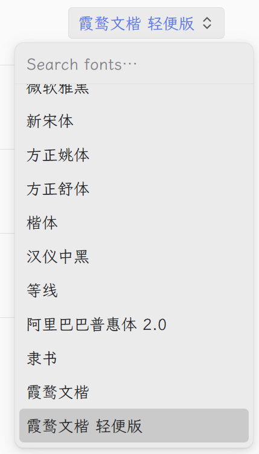

# 界面
title: 界面 Apperance

设置内容：
1、主题
2、字体
3、语言

## 主题
淡色5个主题放一排
黑色2个主题放一排

把括号里的冗余注释都去掉！
主题写入…… 这行注释也给我去掉！
玛德，主题配置写入 pi-flash 的app_settings.json, 白痴，你已经污染了pi！每次启动都报错！

## 字体
字体 Family 选择换成下拉菜单，宽度250px，高度400px，第一行是input框用来快速筛选字体

字体大小改变时，要直接反应在界面上

## 语言
三个一行左对齐，宽度100px

=== 备注 ===
title从外观改为界面
删除版本号

提示音选项放到 【其他】设置页

---

# 

